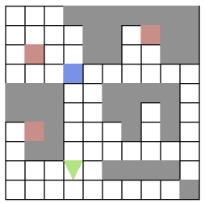

# README

## Introduction

This program will generate a robot that could automatically find all the markers and bring them  home. The markers and blocks were already set in `constant.h` file.

But theoratically the robot could handle all the situations no matter the number of them or what position they are at.

By defalt, the initial position is (3,3). The user could set the robot's initial position which is also where the home is.

## Compling, Running and Setting

To compile the program, the `main.c` file will need a linker to `graphics.c`

- `gcc main.c graphics.c`

To run the program use the following command under the `CW repository`

- `./a.out | java -jar drawapp-3.0/drawapp-3.0.jar`

To set a initial position and direction of the robot, for instance `(3,3) up`. Using the following line

- `./a.out 3 3 up | java -jar drawapp-3.0/drawapp-3.0.jar`

## Graphics

- In this program, different colour represent different object
  - Grey: Blocks
  - Green: Robot
  - Red: Marker
  - Blue: Home